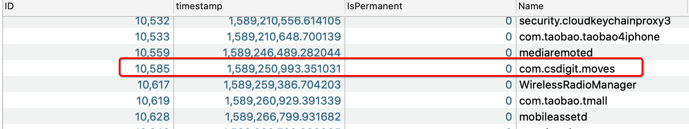
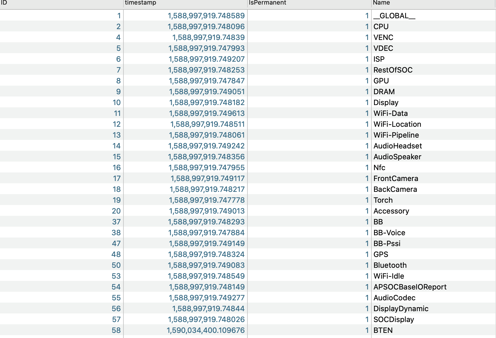

[TOC]

# iOS 耗电量优化

**前言:  在电量排行榜没出之前, 用户对单个应用的耗电情况几乎是无感的, 随着Apple推出的电量排行榜, 让iPhone用户更加关注应用耗电量的问题, 如果电量排行TOP10 中有你的应用的话, 轻者投诉, 重者卸载, 这也让开发者不得不重视应用耗电量的问题了**


## 1. 耗电量概念


`x 轴`为时间，`y 轴`为电量消耗的坐标图

* Idle 表示app处于休眠状态，几乎不使用电量。
* Active状态说明app处于工作状态，用电量比较高，图中的第二个 Active 的耗电远高于第一个，这是因为app所做的工作类型不同而导致的。
* Overhead指的是调起硬件来支持app功能所消耗的电量，这部分是支持硬件工作必要的电量消耗。
* 图中横线以下所包区域是固定开销（Fixed Cost），横线以上区域是动态开销（Dynamic cost）。


## 2. 节省电量的基本原则

- **识别：想清楚你需要app在特定时刻需要完成哪些工作，如果是不必要的工作，考虑延后执行或者省去。**
- **优化：优化app的功能实现，尽可能以更有效率的方式去完成功能。**
- **合并：不需要立刻获取，可以延后合并执行，比如合并网络**
- **减少：在满足需求的基础上，尽量减少做重复工作的频率.**


## 3. 耗电大户

* **网络**: app进行网络通信时，蜂窝数据和Wi-Fi等元器件开始工作就会消耗大量电能，应减少数据传输，合并网络请求，适当的网络延时等。
* **定位**: app为了记录用户的活动或者提供基于位置的服务会进行定位。定位精度越高，定位时间越长，消耗电量也就越多。
* **CPU:** app做的每件事几乎都需要用CPU，所以CPU是电能消耗大户，高CPU使用时会迅速消耗掉用户的电池电量，所以我们要更合理的使用CPU，降低能耗
* **传感器和蓝牙:** 长时间用不上加速度计、陀螺仪、磁力计等设备的动作数据时，应该停止更新数据，不然也会浪费电能。应按需获取，用完即停。蓝牙活动频度太高会消耗电能，应该尽量分批、减少数据轮询等操作


## 4. 电量测试 -- 眼观

简单的耗电量测试, 将手机电量控制在固定的位置,  同时控制其他可能会影响测试结果的因素, 如 wifi, 蓝牙, 屏幕亮度等等, 通过执行相应的操作后, 来观察iPhone的掉电量, 或者用程序取出当前剩余电量(`[UIDevice currentDevice].batteryLevel`).  这种测试方法比较简单,  如果非常明显的耗电问题, 还是可以发现的, 但是如果不是非常明显的问题, 没有具体的数据支撑, 还是没办法处理的.


## 5. 电量测试 -- Xcode 测试耗电量

xcode自带了耗电量测试工具instruments->Energy Log，可以测试电量，测试方法与粗放的耗电量测试基本类似，不同的是，测试的时候，它需要手机上选择开发者——Logging——Energy，选择Start Recording就可以测试了。一段时间以后再stop，再用手机连接到电脑的instrument上，import记录就可以了。这种方法得到的是一个耗电等级，能一定程度放反应耗电量状况，但是同样的，没有具体的电流电压数据。

**Energy Impact 中不同颜色带包的含义**

Energy Impact会实时展示电量消耗，每个柱子代表每秒的电量消耗，通过每个柱子由不同的颜色组成，展示各部分电量消耗的比例，依次是Overhead（红色）、CPU（蓝色）、网络（深黄）、定位（淡黄）、GPU（绿色）、后台（深灰）、前台（淡灰）、Suspend（白色）。


## 6. 电量测试 -- 系统级别日志解析

私有api获取电量信息可以参考[越狱/私有API获取电量信息](https://cloud.tencent.com/developer/article/1006222), 这里略过, 主要分析系统存储的数据库

**私有API获取的部分参数解释: **

CurrentCapacity : 当前剩余电量

FullCharged: 是否满电量

isCharging: 是否正在充电

MaxCapacity: 最大电池容量

Voltage: 当前电压

iphone 电池工作电压基本在4v左右, 


**1. 获取数据库方法**

```
1. 登录Apple开发者网站[](https://developer.apple.com/documentation/)
2. 选择最底部菜单栏下的 support 下边的 Feedback & Bug Reporting
3. 进入页面后选择 Profiles and Logs
4. 进入到下级页面中选择 'Battery Life for iOS', 后边有证书和说明, 按照说明安装证书即可
5. 安装后, 将设备同步到电脑, 在"~/Library/Logs/CrashReporter/MobileDevice/[Your_Device_Name]/"下查找.PLSQL 或者PLSQL.gz 文件.
```


**2. 根据表二中对数据库中的表明解释, 选择合适的表开始进行数据分析**

**1. 根据表`PLBatteryAgent_EventBackward_BatteryUI` 绘制测试期间的电池百分比数据.**

说明:电量百分比数据，每 20 秒一条数据,

字段说明:

```
ID: 主键,
timestamp: 时间戳,
IsCharging: 是否在充电,
Level: 剩余电量百分比
```


**2. 根据`PLAccountingOperator_EventNone_Nodes` 确认目标应用的节点号**

说明: App 结点信息，每个 APP 对应唯一的结点号。用来确定手机内具体哪个 App

字段说明:

```
ID: 节点号码
timestamp: 时间戳, 猜测应该是应用的初次安装时间
IsPermanent: 是否是永久居民, 猜测应该是代表是都未系统级的应用
Name: boundle identifier
```




 **3. 根据`PLApplicationAgent_EventForward_Application` 获取app状态信息**

表说明:  App 运行信息，记录每个 App 在哪个时间段以什么状态运行

字段说明:

```
ID: 应该是存储数据时候的主键
timestamp: 时间戳
identifier: 应用标识
pid: 猜测应该是进程ID
state: 运行状态 --> 1,2,4,8, 不知道对应的是什么状态
reason: 猜测应该是系统掉起还是用户调起的, --> 0,1

因为没有官方的文档说明, 部分字段基本靠猜测, 等绘制完图标的继续观察字段含义
```


**4. 根据`PLAppTimeService_Aggregate_AppRunTime` 获取app的运行时长**

表说明:  APP 的运行时长统计，每个运行过的 APP，一小时一条数据

字段说明:  基本靠猜

```
ID: 主键
timestamp: 时间戳
BackgroundTime: 后台运行时长
screenOnTime: 前台运行时长
BundleID: 标识符
```


**5. 根据`PLAccountingOperator_Aggregate_RootNodeEnergy` 获取app使用的详细信息**

表说明: APP 的电量详细数据，记录每个 APP 的CPU\GPU\DRAM\ISP 等的耗电信息。一小时更新一次数据。


## 7. 参数列表及说明

### **表一: 电量信息数据库中部分表名及说明:**

|                             表明                             |                             描述                             |
| :----------------------------------------------------------: | :----------------------------------------------------------: |
|            PLBatteryAgent_EventBackward_BatteryUI            |          电量百分比数据， (数据显示每5分钟采集一次)          |
|             PLBatteryAgent_EventBackward_Battery             | 整台机器的电量数据，包含电流、电压、温度等，每 20 秒 左右一条数据 |
|           PLIOReportAgent_EventBackward_EneryModel           | 整机的详细电量数据。包含 CPU\GPU\DRAM\ISP 等关键信息。每半小时到一小时一条数据 |
|             PLAccountingOperator_EventNone_Nodes             | App 结点信息，每个 APP 对应唯一的结点号。用来确定手机内具体哪个 App |
|         PLApplicationAgent_EventForward_Application          |    App 运行信息，记录每个 App 在哪个时间段以什么状态运行     |
|            PLAppTimeService_Aggregate_AppRunTime             |     APP 的运行时长统计，每个运行过的 APP，一小时一条数据     |
|        PLAccountingOperator_Aggregate_RootNodeEnergy         | APP 的电量详细数据，记录每个 APP 的CPU\GPU\DRAM\ISP 等的耗电信息。一小时更新一次数据。 |
|            PLAccountingOperator_EventNone_AllApps            |                 手机中安装的所有 App 的信息                  |
| PLBatteryAgent_EventForward_LightningConnectorStatus Lighting |                        接口连接状态。                        |
|            PLBatteryAgent_EventNone_BatteryConfig            | 电池的配置信息。包括电池容量、循环计数、电池寿命、电池温度等信息 |
|           PLBatteryAgent_EventNone_BatteryShutdown           |                   电池导致的意外关机记录。                   |
|              PLCameraAgent_EventForward_Camera               |         相机使用记录。记录了相机类型和使用相机的 App         |
|                PLConfigAgent_EventNone_Config                |               本机的一些配置信息和一些系统设置               |
|              PLDisplayAgent_Aggregate_UserTouch              |             屏幕点击计数。每 15 分钟记录一条数据             |
|             PLDisplayAgent_EventForward_Display              |       屏幕亮度信息。包括流明、尼特、亮度滑竿值等信息。       |
|         PLProcessNetworkAgent_EventPoint_Connection          |   网络连接记录。记录了发起网络连接的 App、地址、端口等信息   |
|              PLXPCAgent_EventPoint_CacheDelete               | 清除缓存的记录。包括申请的空间大小、清除缓存的耗时、清除的缓存大小、服务名称、紧急程度等信息。 |


计算电量的时候注意: 表中的 `Energy` 就是对应消耗的电量了，**这里的单位在 iOS 9 是 `mAh`，iOS 9 及以上应该是 `1/1000 mAh`**


### **表二: RootNodeID硬件对照表**




| name         | description                |
| ------------ | -------------------------- |
| ISP          | 影像处理器                 |
| display      | 显示                       |
| VENC         | 视频编码器                 |
| DRAM         | 内存 (动态随机访问存储器)  |
| Torch        | 手电筒D                    |
| AudioHeadset | 头戴式耳机                 |
| AudioSpeaker | 扬声器                     |
| FrontCamera  | 前摄像头                   |
| backCamera   | 后摄像头                   |
| AudioCodec   | 音频编译码器               |
| BB           | 基带(Base-Band)            |
| BB-Voice     | 基带话音信道               |
| SOC          | system on a chip  片上系统 |
|              |                            |


### **表三: iPhone 电池容量对照表**

|       **型号**        | **容量** (单位mAh) |
| :-------------------: | :----------------: |
|   **iPhone**（原始)   |        1400        |
|     **iPhone 3G**     |        1150        |
|    **iPhone 3GS**     |        1219        |
|     **iPhone 4**      |        1420        |
|     **iPhone 4s**     |        1420        |
|     **iPhone 5**      |        1440        |
|     **iPhone 6**      |        1810        |
|   **iPhone 6 Plus**   |        2915        |
|     **iPhone 6s**     |        1715        |
|  **iPhone 6s Plus**   |        2750        |
|     **iPhone 7**      |        1960        |
|   **iPhone 7 Plus**   |        2900        |
|     **iPhone 8**      |        1821        |
|   **iPhone 8 Plus**   |        2675        |
|     **iPhone XR**     |        2942        |
|     **iPhone XS**     |        2658        |
|   **iPhone XS Max**   |        3174        |
|     **iPhone X**      |        2716        |
|     **iPhone 11**     |        3110        |
|   **iPhone 11 Pro**   |        3190        |
| **iPhone 11 Pro Max** |        3500        |
|   **iPhone12Mini**    |        2227        |
|     **iPhone12**      |        2775        |
|   **iPhone12 Pro**    |        2815        |
| **iPhone12 Pro Max**  |        3687        |


## 8. 观察数据进行针对性的优化